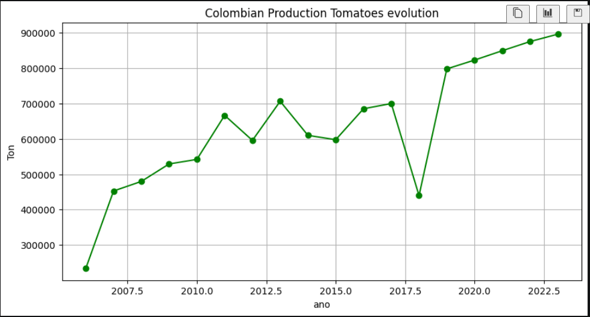
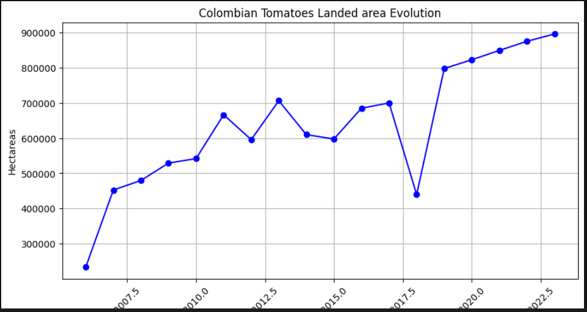
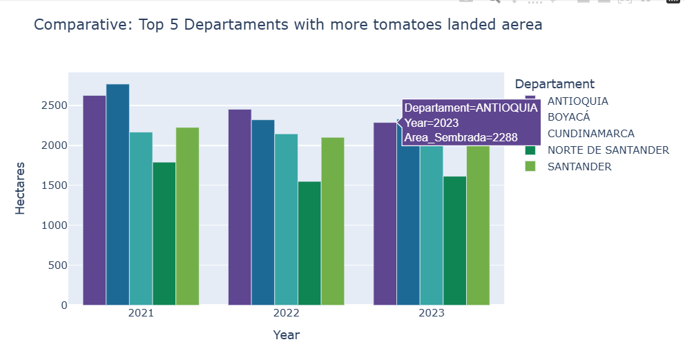
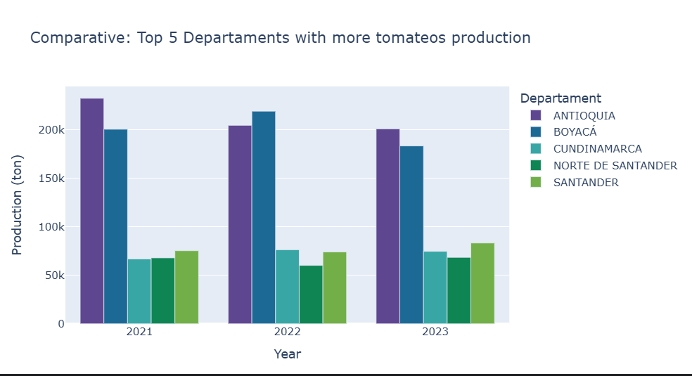
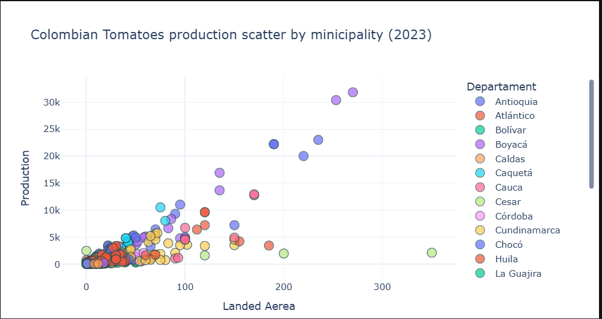

# colombia-agrifood-data-analysis
Economic and technical analysis of the tomato supply chain in Colombia (2007-2024) using Python

## Project Overview
This project performs a comprehensive Exploratory Data Analysis (EDA) of the tomato production chain in Colombia (2021-2024). Using Python, I analyze production volumes, planted areas, and technical yields to identify regional efficiency gaps.

## Key Insights
* **Production Concentration:** Identified the Top 5 departments leading the national market.
* **Technical Efficiency:** Calculated yields (tons per hectare) to distinguish between intensive and extensive farming models.
* **Regional Clusters:** Visualized municipal dispersion to identify high-productivity hubs.

## Visual Analysis
### 1. National behaviour 
Tomate National production 

Tomate National Landed Aerea

### 2. Regional Comparison (Top 5 Leaders)
Comparing production performance across the most relevant departments.

### 3. Municipal Dispersion & Efficiency
Identifying production outliers and regional clusters.

## Tech Stack
* **Data Wrangling:** Pandas
* **Visualization:** Plotly Express, Matplotlib
* **Economic Indicators:** Yield analysis (t/ha), Growth trends.

---
**Mario Velasquez** *Industrial Engineer & Economist | Data Analyst*
